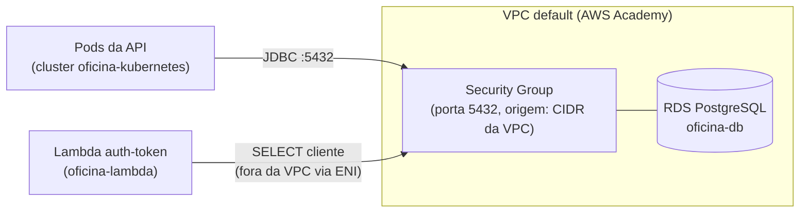

# oficina-database

Infraestrutura como código (Terraform) do banco de dados gerenciado da oficina — Terceiro Tech
Challenge da Pós-Tech em Arquitetura de Software (FIAP).

## Propósito

Provisionar e versionar, de forma independente dos demais componentes, o banco de dados relacional
usado pela [API principal (`oficina`)](https://github.com/rremiao/oficina) e consultado diretamente
pela [function serverless de autenticação (`oficina-lambda`)](https://github.com/rremiao/oficina-lambda).
Este repositório é dono apenas da infraestrutura do banco — o schema (tabelas, migrations, índices)
continua versionado no repositório `oficina`, que é quem efetivamente acessa os dados via Flyway e
Spring Data JPA.

## Tecnologias

- Terraform (~> 1.5)
- AWS Provider (~> 5.0)
- Amazon RDS para PostgreSQL 15+
- GitHub Actions (validação da infraestrutura)

## Pré-requisitos

- Terraform >= 1.5.0
- Credenciais AWS configuradas (`aws configure` ou variáveis `AWS_ACCESS_KEY_ID` /
  `AWS_SECRET_ACCESS_KEY` / `AWS_SESSION_TOKEN`, no caso do AWS Academy/Learner Lab)
- Acesso à VPC default da conta (cenário padrão no Learner Lab)

## Estrutura

```text
.
|-- infra/
|   |-- main.tf                     # security group, subnet group e instância RDS
|   |-- variables.tf
|   |-- outputs.tf
|   |-- providers.tf
|   |-- versions.tf
|   `-- terraform.tfvars.example
|-- docs/
|   |-- der.md                      # diagrama entidade-relacionamento do schema
|   |-- rfc/0001-escolha-do-banco-de-dados.md
|   `-- adr/0001-segregacao-do-state-de-banco.md
`-- .github/workflows/infra-database.yml
```

## Arquitetura



O RDS não é publicamente acessível (`publicly_accessible = false`); só recebe conexões de dentro da
VPC. A API (rodando no EKS) e a Lambda (configurada com ENI na mesma VPC) alcançam o banco pela porta
5432, liberada no security group para o CIDR da VPC inteira — suficiente no cenário de uma única VPC
por sandbox do Learner Lab.

## Execução e deploy

### Bootstrap do bucket de state (uma vez só, por conta AWS)

O backend `s3` é parcial de propósito (`backend "s3" {}` em `versions.tf`) — o bucket não é
provisionado pelo próprio Terraform deste repositório. Criar manualmente antes do primeiro `init`:

```bash
BUCKET="oficina-database-tfstate-$(aws sts get-caller-identity --query Account --output text)"
aws s3api create-bucket --bucket "$BUCKET" --region us-east-1
aws s3api put-bucket-versioning --bucket "$BUCKET" --versioning-configuration Status=Enabled
aws s3api put-public-access-block --bucket "$BUCKET" \
  --public-access-block-configuration BlockPublicAcls=true,IgnorePublicAcls=true,BlockPublicPolicy=true,RestrictPublicBuckets=true
```

No AWS Academy Learner Lab, a conta é reciclada periodicamente — se o bucket sumir, este passo
precisa ser refeito antes de qualquer `terraform init`.

### Aplicando manualmente

```bash
cd infra
cp terraform.tfvars.example terraform.tfvars
# edite terraform.tfvars com a senha do banco e demais parâmetros

terraform init \
  -backend-config="bucket=<bucket-do-bootstrap-acima>" \
  -backend-config="key=oficina-database/terraform.tfstate" \
  -backend-config="region=us-east-1"

terraform plan -out=tfplan
terraform apply tfplan
```

Após o `apply`, os outputs relevantes para os outros repositórios são:

- `rds_endpoint` / `rds_port` / `jdbc_url` — usados no `ConfigMap` da aplicação
  (`oficina-kubernetes`/`oficina`).
- `rds_security_group_id` — caso outro componente precise ser liberado explicitamente no security
  group do banco.

```bash
terraform output
```

Para destruir o ambiente ao final do Lab:

```bash
terraform destroy
```

Esse é o **último** repositório a derrubar (a Lambda e a app do `oficina-kubernetes` dependem deste
RDS). Ordem completa entre os 4 repositórios, com o porquê de cada passo, no
[runbook do ambiente completo](https://github.com/rremiao/oficina-kubernetes/blob/main/docs/runbook-ambiente-completo.md)
(repositório `oficina-kubernetes`).

## Pipeline (CI/CD)

O workflow [`infra-database.yml`](.github/workflows/infra-database.yml) tem dois jobs:

- **`validate`** (push e PR para `main`): `fmt -check`, `init -backend=false`, `validate`. Não toca
  em recursos AWS, roda sempre.
- **`deploy`** (só push na `main`, ou disparo manual): aplica o Terraform de verdade
  (`terraform apply -auto-approve`), usando o state remoto no bucket S3 do bootstrap acima.

O `deploy` depende de credenciais AWS válidas configuradas como **Secrets** do repositório
(Settings → Secrets and variables → Actions):

| Nome | Tipo | Conteúdo |
|---|---|---|
| `AWS_ACCESS_KEY_ID` | Secret | Credencial temporária da sessão AWS Academy |
| `AWS_SECRET_ACCESS_KEY` | Secret | Credencial temporária da sessão AWS Academy |
| `AWS_SESSION_TOKEN` | Secret | Credencial temporária da sessão AWS Academy |
| `DB_PASSWORD` | Secret | Senha do usuário master do RDS |
| `TF_STATE_BUCKET` | Variable | Nome do bucket criado no bootstrap acima |

**Importante**: como o Learner Lab usa credenciais de sessão (expiram em poucas horas, mudam a cada
"Start Lab"), os 3 secrets de AWS precisam ser **atualizados manualmente antes de cada push que deva
disparar um deploy real** — a pipeline falha com uma mensagem clara (`Credenciais AWS invalidas ou
expiradas`) se estiverem vencidas, em vez de tentar aplicar com credencial inválida.

## Modelo de dados

O diagrama entidade-relacionamento completo, com as observações sobre o schema atual, está em
[`docs/der.md`](docs/der.md). A justificativa da escolha do PostgreSQL como banco gerenciado está em
[`docs/rfc/0001-escolha-do-banco-de-dados.md`](docs/rfc/0001-escolha-do-banco-de-dados.md).

## Decisões arquiteturais

- [ADR-0001 — Segregação do state de banco em repositório próprio](docs/adr/0001-segregacao-do-state-de-banco.md)
- [ADR-0002 — Isolamento de rede do RDS](docs/adr/0002-isolamento-de-rede-do-rds.md)
- [ADR-0003 — Dimensionamento e ausência de backup](docs/adr/0003-dimensionamento-e-ausencia-de-backup.md)
- [ADR-0004 — Deploy automático via pipeline, com state remoto](docs/adr/0004-deploy-automatico-via-pipeline.md)

## Swagger / Postman

Não aplicável — este repositório não expõe API própria. A documentação OpenAPI da aplicação que
consome este banco está no repositório [`oficina`](https://github.com/rremiao/oficina).
