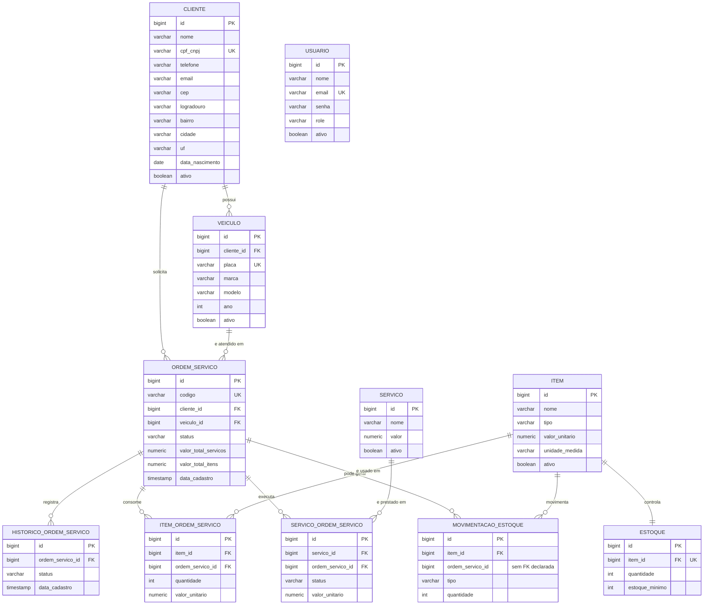

# Modelo de dados — Diagrama Entidade-Relacionamento

Modelo relacional da oficina, versionado hoje pelas migrations Flyway do repositório
[`oficina`](https://github.com/rremiao/oficina) (`src/main/resources/db/migration`, `V1` a `V10`).
Este documento existe neste repositório porque é aqui que a infraestrutura do banco gerenciado é
provisionada — a fonte de verdade do schema em si continua nas migrations do `oficina`.

## Diagrama

`USUARIO` não tem relacionamento de chave estrangeira com as demais tabelas — é a base de login dos
operadores da oficina (autenticação por e-mail/senha), independente do fluxo de atendimento ao
cliente.

## Pontos de atenção do modelo

- **`movimentacao_estoque.ordem_servico_id`** referencia `ordem_servico` apenas por convenção da
  aplicação: a coluna existe e é usada para correlacionar baixas de estoque com a OS que as gerou,
  mas a migration `V6` não declara a constraint de chave estrangeira. Isso é uma dívida técnica do
  schema atual, não uma decisão deliberada — deveria ganhar a FK numa migration futura.
- **`estoque.item_id`** é `UNIQUE`, modelando uma relação 1:1 entre item e seu controle de estoque
  (em vez de 1:N), o que faz sentido porque cada item tem exatamente um saldo controlado.
- **Índice funcional `idx_cliente_cpf_cnpj_digitos`** (`V10`) existe especificamente para a consulta
  que a function serverless do `oficina-lambda` faz ao autenticar por CPF, comparando o documento
  normalizado (sem pontuação). Ver
  [`V10__index_cpf_cnpj_normalizado.sql`](https://github.com/rremiao/oficina/blob/main/src/main/resources/db/migration/V10__index_cpf_cnpj_normalizado.sql)
  no `oficina`.
- **`ordem_servico.codigo`** é gerado por uma função/trigger PL/pgSQL (`calcular_proximo_codigo_os`)
  com um contador anual (`os_contador`), garantindo um código legível (`OS-2026-000123`) e único sem
  depender de lógica de aplicação.
